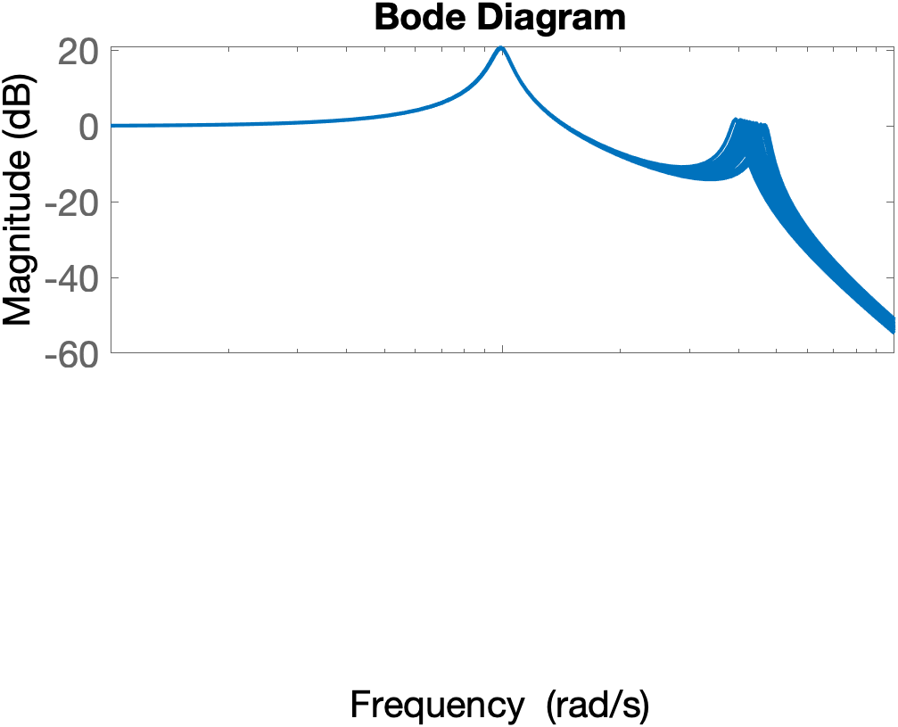
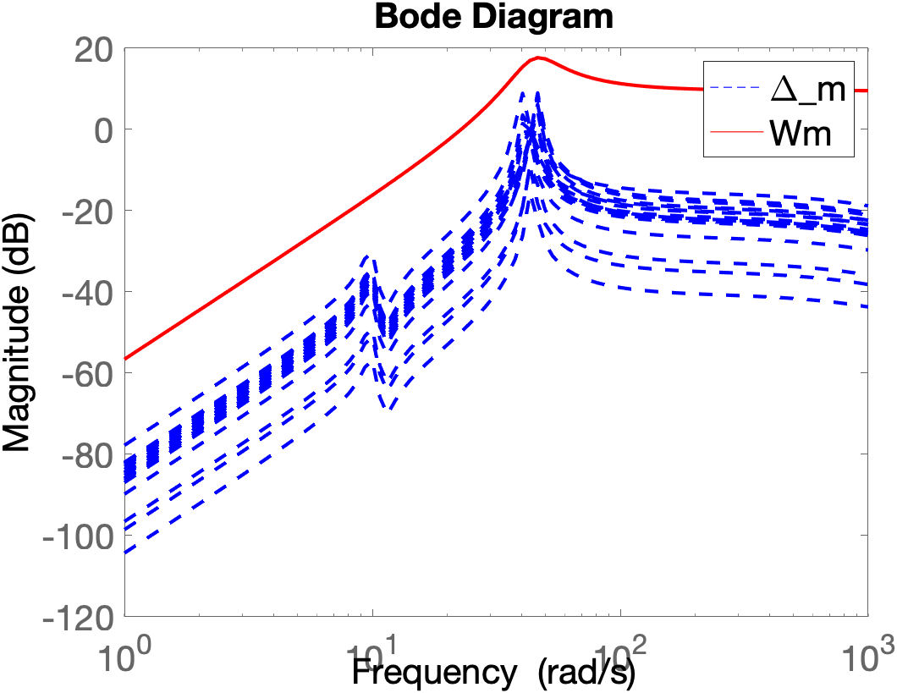
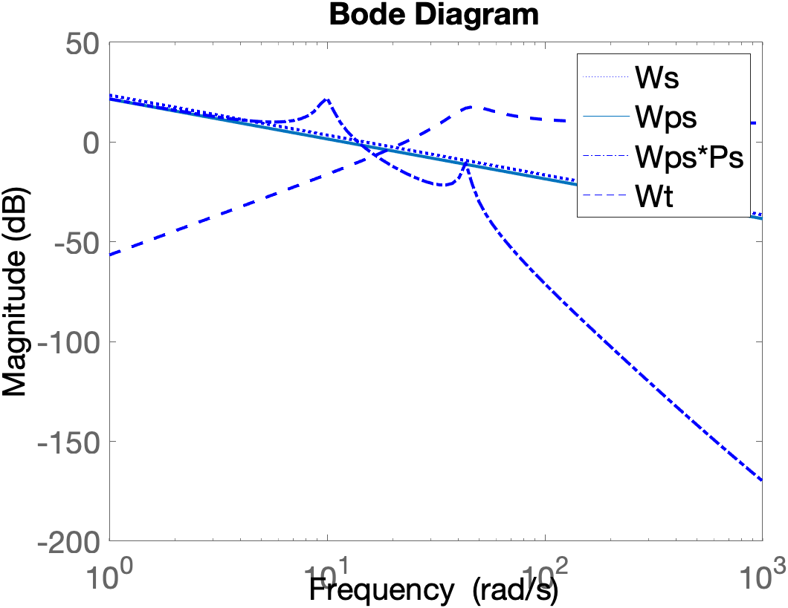
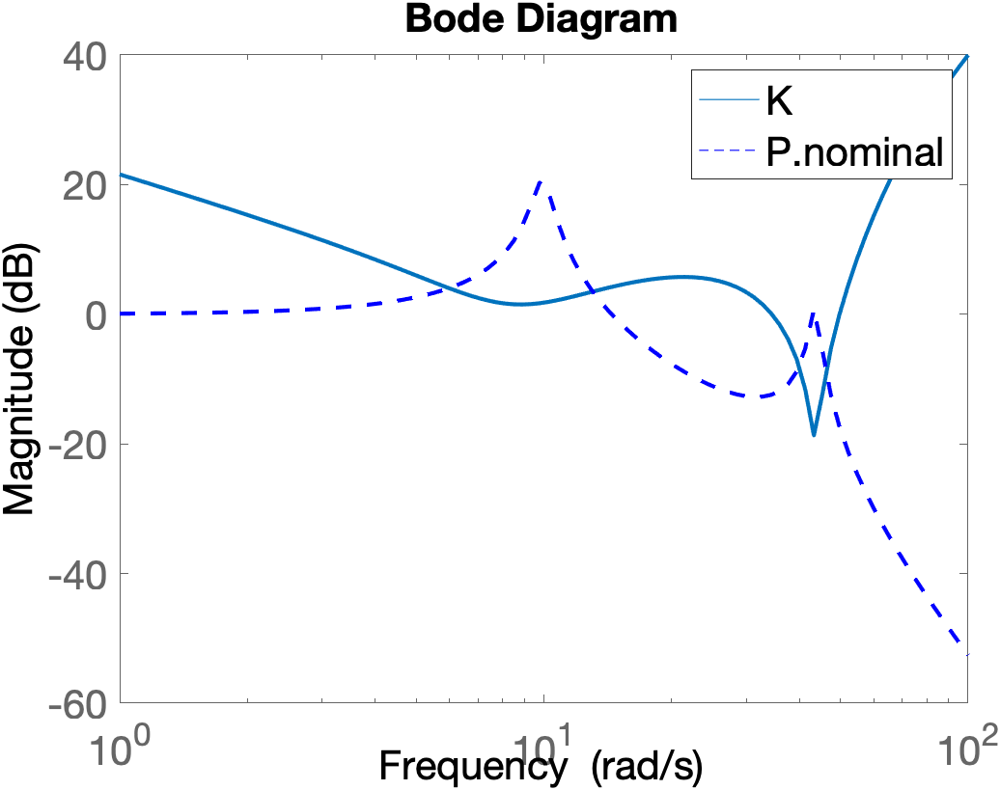
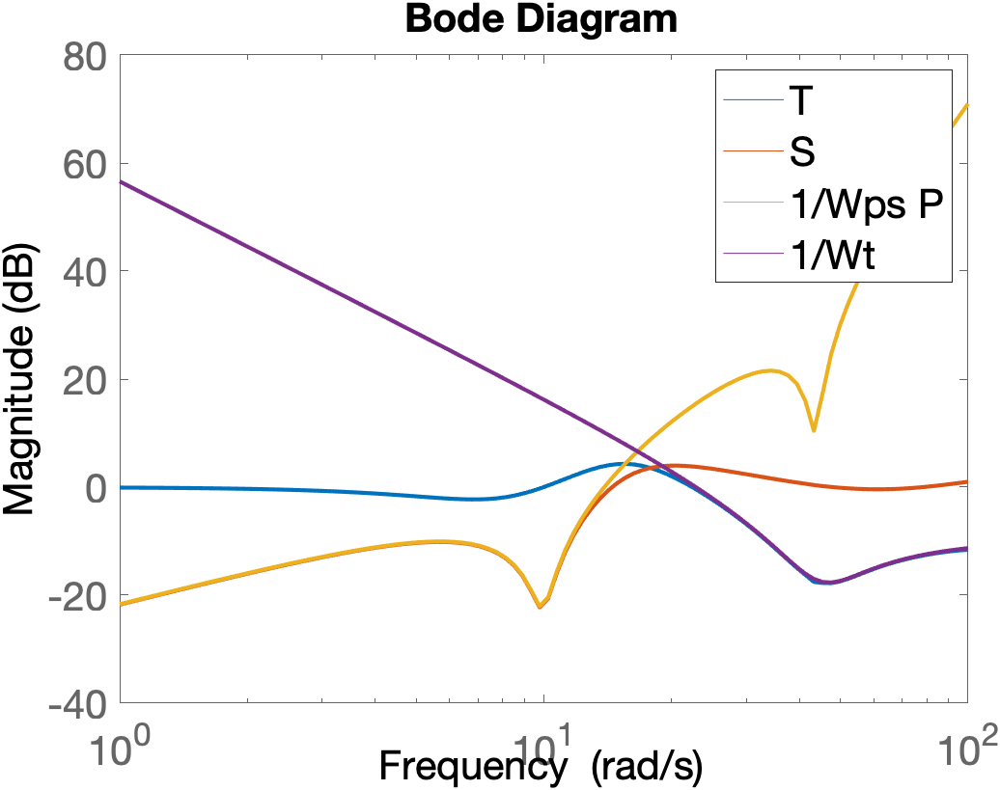
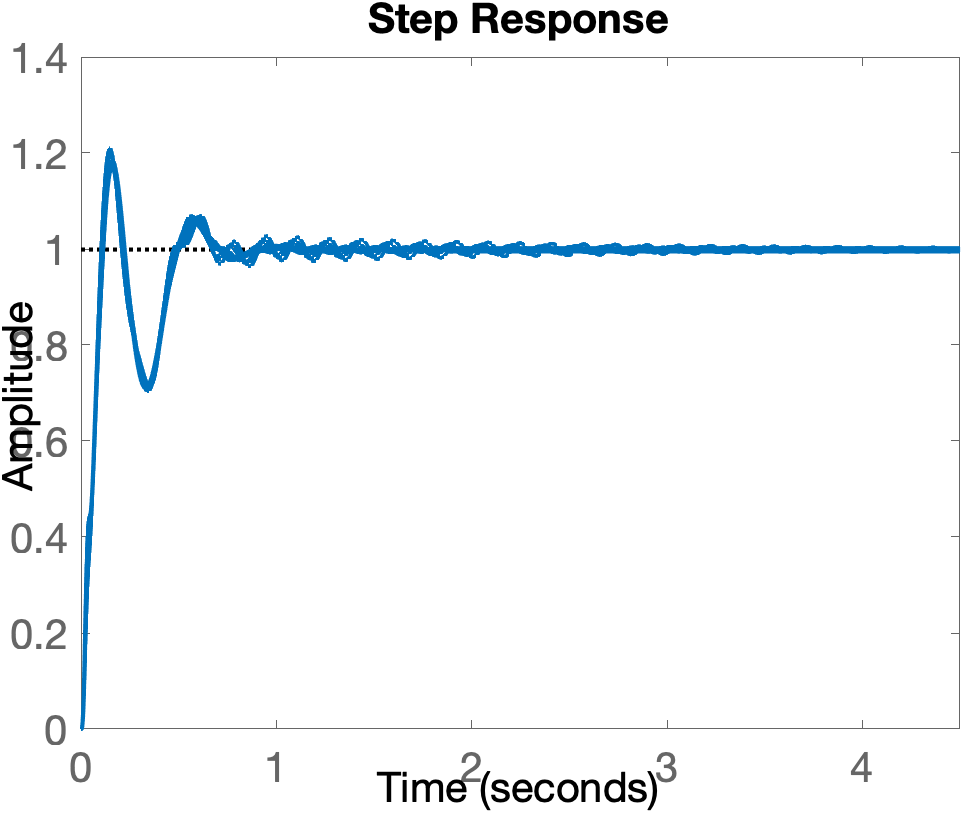
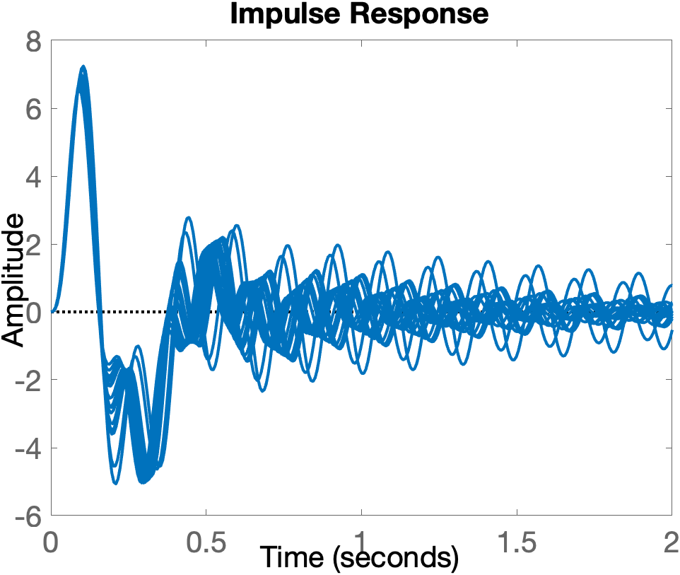
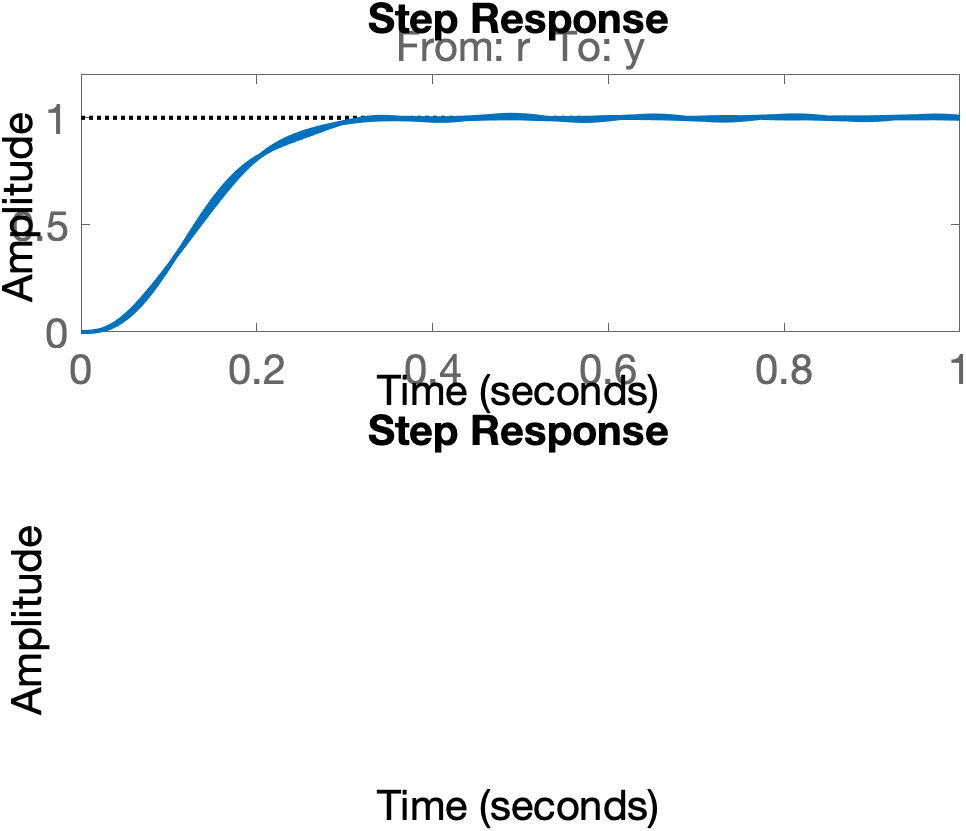
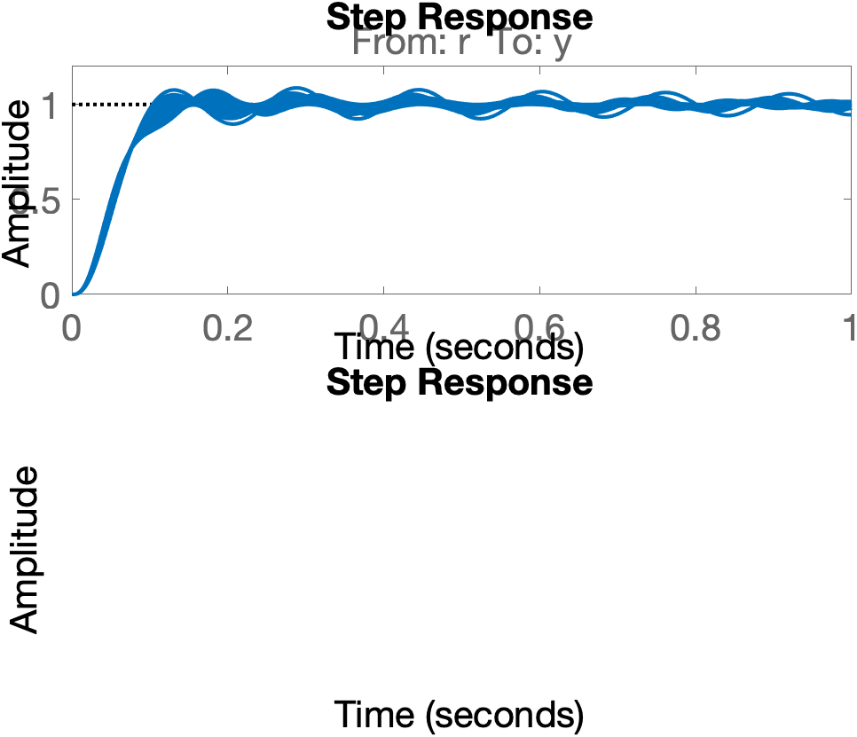

修正混合感度問題＋モデルマッチング2自由度制御系

（乗法的摂動に対するロバスト安定化、外乱抑制、定常特性（過渡応答）改善）
```
> defgp3
```
乗法的摂動を持つプラント

乗法的摂動⊿mのゲインとそれを包絡する伝達関数Wm

修正混合感度問題（※外乱抑制を考慮）における伝達関数の関係

修正混合感度問題に対するH∞制御によるゲインKの特定

修正混合感度問題における相補感度関数Tと感度関数Sのプロット

修正混合感度問題＋H∞制御により得られた制御ゲインKを用いた際の目標値追従特性（Tに対するステップ応答）

修正混合感度問題＋H∞制御により得られた制御ゲインKによる外乱抑制特性（M＝PSに対するインパルス応答）

モデルマッチング2自由度制御系による目標追従値特性の改善(ωn=20）

モデルマッチング2自由度制御系による目標追従値特性の改善(ωn=50）➟若干特性が悪化する



